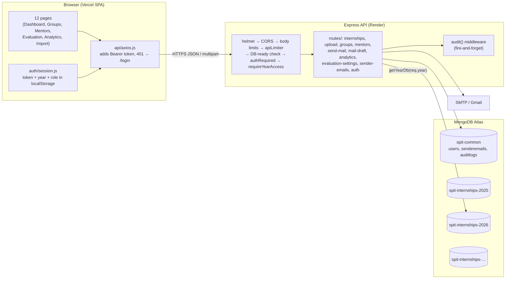

# Architecture — SPIT Internship Management & Evaluation Portal

_Last verified against the code: 2026-10-04._

## 1. What it is, and who uses it

A web portal that the internship office at **Sardar Patel Institute of Technology (SPIT), Mumbai**
uses to run the 8th-semester internship cycle each academic year:

1. **Collect records**: import the placement/internship spreadsheet (one row per student).
2. **Form evaluation groups**: put students into groups of about 5.
3. **Allocate evaluators**: give every group one *internal* mentor (SPIT faculty examiner) and one
   *external* mentor (industry evaluator).
4. **Mail the evaluators**: email each mentor an Excel sheet of their group and a link to the evaluation sheet.
5. **Collect marks**: import six evaluation spreadsheets (meeting attendance, weekly reports,
   final report, external marks, external viva, internal viva).
6. **Compute and report**: show a weighted final score per student, plus company/branch analytics.

**Users today:** 2 office staff, who share **one** admin login. Students and mentors **never log in**.
They exist only as data.

## 2. Tech stack

| Layer | Choice |
|---|---|
| Frontend | React 19 (Create React App), React Router 7, Tailwind 3, Recharts, axios, SheetJS `xlsx` |
| Backend | Node + Express 4, Mongoose 7, multer (in-memory uploads), nodemailer, SheetJS `xlsx` |
| Database | MongoDB Atlas |
| Auth | bcrypt password hash + JWT (12 h), held in `localStorage` |
| Hosting | Frontend on Vercel, backend on Render (free tier, so it cold-starts) |
| Tests | Jest + supertest, 40 unit tests (middleware/utils only) |

## 3. Component diagram

## 4. Data model

**Multi-tenant by academic year.** Each year has its own database (`spit-internships-<year>`).
`getYearDb(year)` picks it per request, using the year baked into the JWT. Shared, year-independent
data lives in `spit-common`.

| Collection | DB | What it holds | Sensitive? |
|---|---|---|---|
| `internships` | year | One doc per student, keyed by unique `uid`. Identity (name, email, phone, gender, branch), internship (company, type, dates, offer-letter link, stipend, CTC), group link, and **evaluation marks** | **Yes: student PII + compensation + marks** |
| `groups` | year | `name` ("Group 7"), `students[]` (ObjectIds), `externalMentor`, `internalMentor`, `mailSent` | Low |
| `mentors` / `internalmentors` | year | name, email, phone, `isAssigned` flag | Yes (contact PII) |
| `maildrafts` | year | one `global` subject/body template + evaluation link | No |
| `evaluationsettings` | year | `totalWeeks` + six weights | Integrity-critical (drives every final mark) |
| `users` | common | username, bcrypt hash, `role` (admin/staff), `allowedYears`, lockout counters | Credentials |
| `senderemails` | common | sender address + **AES-256-GCM encrypted** SMTP app password | Secret |
| `auditlogs` | common | who did what, when, from which IP; small PII-free details | Low |

### How a student, a group and a mentor are linked

There are **three** links, and they can drift apart:

- `Group.students[]`: ObjectIds. This is the real membership list.
- `Internship.assignedGroupName`: a **string** copy of the group name. The evaluation overview
  joins on this field.
- `Internship.assignedGroup`: a random UUID made at generation time that **matches no field
  on Group**. In practice it works only as an "is assigned" flag.
- `Mentor.isAssigned` is a cached flag. `POST /groups/sync-mentors` exists to repair it when it drifts.

## 5. Key flows

**Login.** `POST /api/auth/login {username, password, year}` → user lookup in `spit-common` →
lockout check (8 failures → 15 min) → bcrypt compare → the server checks the year against the
user's `allowedYears` → JWT `{sub, username, role, year, allowedYears}`. Switching year means
logging in again.

**Student import (two-step).** The browser parses the sheet with SheetJS and maps the headers.
`POST /api/upload/import` then upserts row by row on `uid`. Only whitelisted fields
(`utils/allowedFields.js`) are written, so a spreadsheet cannot set marks or group assignment.

**Group generation.** `POST /api/groups/generate` → selects unassigned students (optional
branch/company filter) → Fisher–Yates shuffle → splits into N groups (exact size, or auto-balanced).
When `assignToGroups` is set, it `bulkWrite`s the internships and then `insertMany`s the groups.
These two writes are **not transactional**.

**Mentor allocation.** Random allocation in bulk or per group from mentors with `isAssigned=false`,
or a manual pick through `PUT /groups/:groupId/assign-mentor`, which rejects a mentor already
used elsewhere with 409.

**Mailing.** `POST /api/send-mail {groupId, recipientType, senderEmailId}` → builds the group's
Excel in memory → decrypts the chosen sender's app password → nodemailer → sets `mailSent`.

**Evaluation.** Six upload endpoints each update one marks field, matched by `uid`. The
**weighted final score is computed in the browser** (`EvaluationOverview.js`), not on the server.

## 6. Security model (current)

- Every `/api` route past `/api/auth` requires a JWT and a permitted year.
- Two roles. Only `admin` may: clear all groups, delete all mentors, change evaluation weights,
  add sender emails. Enforced server-side with `requireRole('admin')`.
- Write whitelists stop mass assignment. Regex input is escaped. Uploads are capped at 5 MB with a
  type check. JSON bodies are capped at 1 MB (25 MB on `/upload`). Login is rate-limited per IP
  and locked per account. helmet sits on the API and security headers on Vercel. 5xx messages
  are redacted in production.
- Destructive one-off scripts are quarantined in `backend/scripts/dangerous/` behind a guard.

## 7. Known issues found in the 2026-10-04 review

Severity: 🔴 act now · 🟠 fix soon · 🟡 when convenient.

| # | Sev | Finding | Where |
|---|---|---|---|
| 1 | 🔴 | **The real student spreadsheet (~408 students: names, UIDs, phones, emails, CTC, stipend, offer-letter links) is committed and pushed to a *public* GitHub repo.** It is still in git history even if deleted. | `Internships 26 - All.csv` (commit `836a344`) |
| 2 | 🔴 | All the hardening work (≈54 files: roles, audit log, rate limits, whitelists, tests) is **uncommitted**. One bad `git checkout` loses it, and production still runs the old code. | working tree |
| 3 | 🟠 | The frontend never uses `isAdmin()`. Staff see admin-only buttons and get a 403 after clicking. | `auth/session.js:19`, no callers |
| 4 | 🟠 | The Evaluation page **auto-saves weights on mount** with default values (400 ms debounce). If the settings GET is slow (Render cold start) or fails, defaults overwrite the real weights. Every admin page visit writes an audit row. Staff edits fail silently with a 403. | `EvaluationOverview.js:72-79` |
| 5 | 🟠 | Marks fields default to `0`, so "not uploaded yet" and "scored zero" look the same. The UI shows a real 0 as "-". The viva maximum (40) and external maximum (100) are hard-coded in the browser, and imports have no range check. | `Internship.js`, `EvaluationOverview.js:105-110`, `upload.js` |
| 6 | 🟠 | Final scores are computed only in the browser, so no server API or export can return an authoritative final mark. | `EvaluationOverview.js:118` |
| 7 | 🟠 | Group generation writes internships, then groups, without a transaction. A failure in between (e.g. duplicate group name in a concurrent run) leaves students flagged as assigned with no group. | `groups.js:197-235` |
| 8 | 🟠 | `PUT /groups/:id` can overwrite `students[]` and `name` without updating `Internship.assignedGroup*`. Renaming a group breaks the evaluation-overview join. | `groups.js:1359` |
| 9 | 🟠 | Bulk mentor allocation **reuses mentors** when there are fewer mentors than groups. The manual assign route forbids exactly that (409). | `groups.js:729,859` |
| 10 | 🟠 | Marks imports, single mentor deletes and `POST /send-mail/:groupId` are **not audited**, although marks are the most integrity-sensitive data. | `upload.js`, `send-mail.js` |
| 11 | 🟡 | `/analytics/stipends` uses `$toDouble`, which throws on values like `-` (17 rows in real data). The endpoint is unused by the UI. | `analytics.js:171` |
| 12 | 🟡 | Import counts "inserted" vs "updated" by comparing `createdAt`/`updatedAt` within 1 s, which is a heuristic and can be wrong. | `upload.js:695` |
| 13 | 🟡 | Two mentor APIs (`/api/mentors` and `/api/upload/mentors*`) do the same work. N+1 queries in `buildMentorDetails`. | `mentors.js`, `upload.js` |
| 14 | 🟡 | Logs still print emails and request bodies with emoji (mail, import, export). | `send-mail.js`, `mail-draft.js`, `groups.js` |
| 15 | 🟡 | Two `package.json`s (root and `backend/`) with drifting versions (`nodemailer` ^7 vs ^6). The root one is what runs. | root, `backend/` |
| 16 | 🟡 | `xlsx@0.18.5` has known CVEs (prototype pollution, ReDoS) and parses untrusted uploads on both ends. | both `package.json` |
| 17 | 🟡 | Repo lives in OneDrive, and cloud-synced `node_modules` causes random `errno -4094` build failures. | environment |

The broader backlog (accessibility, responsive layout, pagination, CI, splitting the 1,200-line
`AllGroups.js`) is in `docs/superpowers/plans/2026-09-12-portal-hardening.md`.
